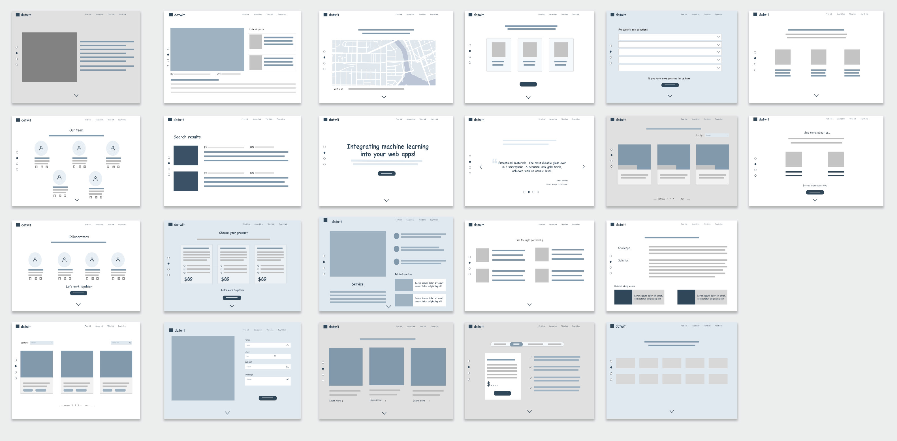
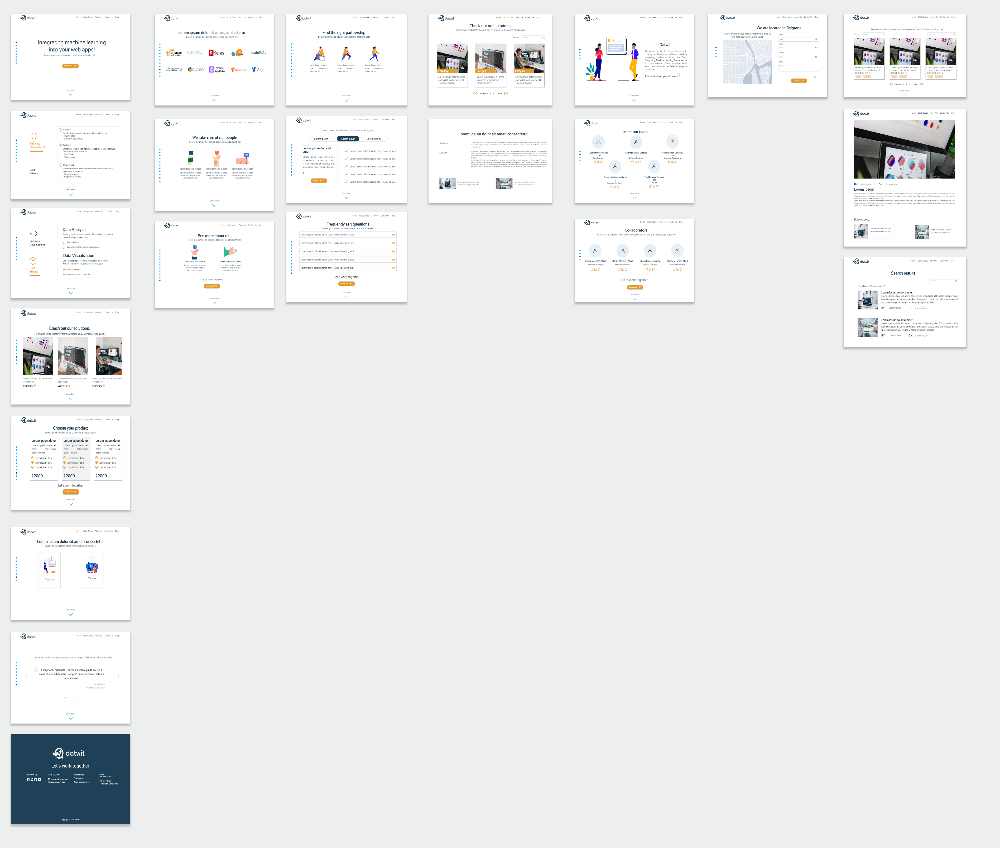

# Landing 3
Version 3.0 Datwit landing page

## Prerequisites
* You have to have installed Nodejs v12.0 o higher. 
If you haven't download it **[here.](https://nodejs.org/en/download/)**
For further information also check these links:
https://phoenixnap.com/kb/update-node-js-version
https://www.whitesourcesoftware.com/free-developer-tools/blog/update-node-js/

## Install
* Clone this repo
* Move to this cloned directory or base repository
* Run `npm i` to install dependencies 
* Run the project with `npm run dev`

## About this redesign 
Datwit is pursuing the purpose of redesigning its landing page. Therefore we need to study the current version and its competitors, so we can evaluate the site's visual evolution to increase its traffic and to improve the experience for our users.

Objectives to achive with this version: 

1. Evaluating the current version to find content mishaps, usability issues, and performance errors that can affect the overall experience using the site.
2. Getting to know the kind of information the users need to become clients, partners, or part of the team.
3. Focusing the design to show specific and personalized content to every kind of user as a potential target.
4. Comming up with new functionalities to make an unique impact on the users.
5. Optimizing development workflows and using the best fit technologies for the new functionalities.

## Designed wireframes and mockups

See the entire design on **[Figma](https://www.figma.com/file/zHh4nOvVnr8jISt0vP1Nd6/Wireframing?node-id=908%3A0)**

